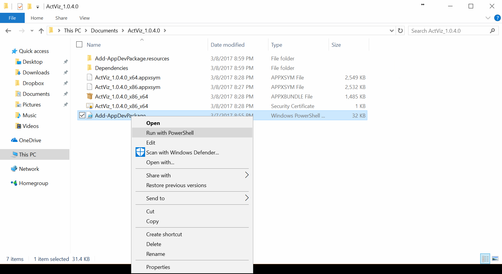

Build and Installation
======================

Install from Release Binary
---------------------------

ActViz is a universal windows application (UWP) and still in development.
You need to enable ``Developer Mode`` in Windows 10 settings before installing ActViz binary.
Follow `Enable your device for development`_ on Microsoft Dev Center to enable ``Developer Mode``.

The ActViz binary is available at `ActViz release tab`_. Download and unzip the compiled binary in your local folder.
Right click on file ``Add-AppDevPackage`` and select ``Run with Powershell`` to install, as shown in the figure below.

After installation, you can run ``ActViz`` from start menu.

Build From Source Using Visual Studio 2017
------------------------------------------

The ActViz application is developed using Visual Studio 2017 Community.
You can download Visual Studio 2017 from `Visual Studio Website`_.

You may download the source codes from github, unzip to your local directory and open ``ActViz.sln``.

You can also add your cloned git repository using ``Team Explorer`` in Visual Studio to pull the source code
to your local directory.

.. _`Enable your device for development`: https://docs.microsoft.com/en-us/windows/uwp/get-started/enable-your-device-for-development
.. _`ActViz release tab`: https://github.com/TinghuiWang/ActViz/releases
.. _`Visual Studio Website`: https://www.visualstudio.com/
